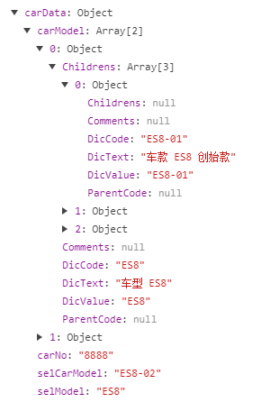

## vue项目实例

### 二级联动

1. 给两个select加v-model，记录状态
2. 先渲染出第一个select，第二个select设置computed，这样第一个select改变的同时，computed也会同步刷新

```html
<tr>
                <td width="20%" class="td-label">车型<br>Model：</td>
                <td width="30%">
                  <select name="Model" id="Model" placeholder="请选择车型" v-model="carData.selModel" >
                    <option :value="v.DicCode" v-for="(v,i) in carData.carModel" >{{v.DicText}}</option>
                  </select>
                </td>
                <td width="20%" class="td-label">车款<br>CarModel：</td>
                <td width="30%">
                  <select name="carModel" id="carModel" placeholder="请选择车款" v-model="carData.selCarModel">
                    <option :value="v.DicCode" v-for="(v,i) in getCarModelNext">{{v.DicText}}</option>
                  </select>
                </td>
              </tr>
```

```js
Data:{
    carData: {
        carNo: 0,
        carModel: [],
        selCarModel: '',
        selModel: '',
      }
}
  
computed: {
  // 选车二级联动
  getCarModelNext: function () {
    var that = this;
    if (this.carData.selModel.length > 0 && this.carData.carModel.length > 0) {
     return this.carData.carModel.filter(function (item) {
       return item.DicCode == that.carData.selModel;
      })[0].Childrens;
     }
  }
 },
```




#### 表单控件上传value和text两个字段

一个用v-model，一个用@change（v-model的值）进行筛选后返回正确值


#### axios的跨域问题

在config文件中修改index.js文件，其中设置下dev下的proxyTable

```js
proxyTable: {
      '/api':{
        target: 'http://10.110.2.102:9528',
        changeOrigin: true,
        pathRewrite:{'/api':'/'}
      }
    },
```

