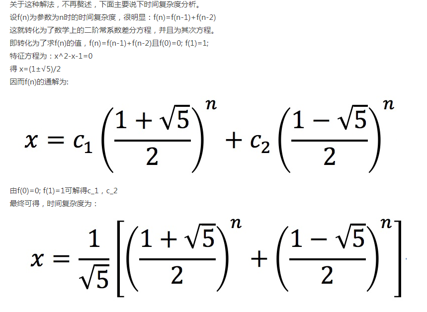
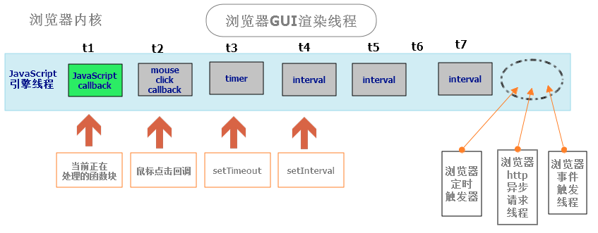

# 面试题汇总

### js计算相关

1. html中有且仅有一个script标签,script标签内有以下代码,请写出以下代码输出的值;

```javascript
var a=1;
  function test() {
    console.log(a);
    try{
      a(3);
      A();
    }catch(e){
      a=2;
    }
    function a(b) {
      a=b;
    }
    console.log(++a);
  }
  test();//function a(b) {a=b;}和3
  console.log(a);//1
```

###CSS偏移响应鼠标点击操作

```css
/*直接在css里响应鼠标操作*/
table { background-color:#000000; cursor:hand; width:100%; } 
td { 
/*设置onmouseover事件*/ 
onmouseover: expression(onmouseover=function (){this.style.borderColor ='blue';this.style.color='red';this.style.backgroundColor ='yellow'}); 
/*设置onmouseout事件*/ 
onmouseout: expression(onmouseout=function (){this.style.borderColor='';this.style.color='';this.style.backgroundColor =''}); 
background-color:#ffffff; 
} 

/*控制表格隔行变色: */
<style type="text/css"> 
tr {background-color:expression((this.sectionRowIndex%2==0)?"#E1F1F1":"#F0F0F0")} 
```

实体标签Etag和最后修改时间Last-modified

```javascript

```

###如何判断当前脚本运行在浏览器中还是node环境?

```
通过判断Global对象是否为window，如果不为window，当前脚本没有运行在浏览器中
```

###什么叫优雅降级和渐进增强？

```
优雅降级：Web站点在所有新式浏览器中都能正常工作，如果用户使用的是老式浏览器，则代码会检查以确认它们是否能正常工作。由于IE独特的盒模型布局问题，针对不同版本的IE的hack实践过优雅降级了,为那些无法支持功能的浏览器增加候选方案，使之在旧式浏览器上以某种形式降级体验却不至于完全失效.

渐进增强：从被所有浏览器支持的基本功能开始，逐步地添加那些只有新式浏览器才支持的功能,向页面增加无害于基础浏览器的额外样式和功能的。当浏览器支持时，它们会自动地呈现出来并发挥作用。
```

1. 匿名函数的执行环境具有全局性:

   ```javascript
   var name = 'qq';
       var obj = {
         name: 'jj',
         getNameFun: function () {
           return function () {
             return this.name;
           }
         }
       }
       console.log(obj.getNameFun()());//'qq'
   ```

   ​

###请写出至少三种跨域请求的解决方法.

```reStructuredText
解决办法：

1、JSONP：

使用方式就不赘述了，但是要注意JSONP只支持GET请求，不支持POST请求。

2、代理：

例如www.123.com/index.html需要调用www.456.com/server.php，可以写一个接口www.123.com/server.php，由这个接口在后端去调用www.456.com/server.php并拿到返回值，然后再返回给index.html，这就是一个代理的模式。相当于绕过了浏览器端，自然就不存在跨域问题。

3、PHP端修改header（XHR2方式）

在php接口脚本中加入以下两句即可：
header('Access-Control-Allow-Origin:*');//允许所有来源访问
header('Access-Control-Allow-Method:POST,GET');//允许访问的方式
```

​

1. 斐波那契数列: 请用递归求解f(20),并写出解法的时间复杂度(注意处理边界)

   ```javascript
   f(1)=1;f(2)=1;
   f(n)=f(n-1)+f(n-2);n>2

   //解法:
   ```

   

2. 请用2种以上方式实现如下功能:每隔1秒依次输出0,1,2...n(至少包含一种ES6的异步实现);

   ```javascript

   ```

   ​

3. 某段dom结构如下:在该dom结构中,li在列表的下标分别是0,1,2,3,4.请分别为每个li添加点击事件,输出响应的下标,注意:使用原生的js,且只能添加事件不能添加属性.

   ```html
   <ul id="list">
     <li>qw</li>
     <li>er</li>
     <li>ty</li>
     <li>ui</li>
     <li>ou</li>
   </ul>
   ```
   ```javascript
   var lis = document.querySelectorAll('li');
       //闭包实现
       for (var i = 0; i < lis.length; i++) {
         lis[i].onclick = (function (j) {
           return function () {
             console.log(j);
           }
         })(i);
       }
       //forEach实现
       lis.forEach(function (v, i) {
         v.onclick = function () {
           console.log(i);
         }
       })
       //ES6实现
       for(let i=0;i<lis.length;i++){
         lis[i].onclick=function(){
           console.log(i);
         }
       }
   ```

   ​

4. 假设有上题相同的dom结构,通过调用outer方法,把list子元素传入到children,代码如下:请在outer函数内添加代码,把获取到的子元素列表,通过apply方式来调用inner,使得inner方法输出值为true;注意浏览器兼容性问题.

   ```javascript
   function outer(){
     
   }
   function inner(){
     console.log(arguments[0].innerHTML.match(/\s+/)[0]=='qw');
   }
   outer(document.getElementById('list').children);
   ```
   ```javascript
   //来自同学的解答
   function outer(children){
       inner.apply(inner,children);
   }
   function inner(){
       console.log(arguments[0].innerHTML.match(/\s+/)[0]=='刘一');//true
   }
   outer(document.getElementById('list').children);
   ```

   ​

5. ```javascript
   var a=10;
           var foo = {
               a: 20,
               bar: function(){
                   var a = 30;
                   console.log(this);
                   return this.a;
               }
           }

           console.log(
               foo.bar(),//20
               (foo.bar)(),//20
               (foo.bar = foo.bar)(),//10
               (foo.bar,foo.bar)()//10
           );
           //(foo.bar = foo.bar)和(foo.bar,foo.bar)是全局函数,this指向Window
   ```

6. ```javascript
   //数组的原型是数组
   console.log(Array.is Array(Array.prototype) );//true
   //其他还是对象
   ```

7. ```javascript
   var a = {n: 2};
   var b = a;
   a.x = a = {n: 3};
   console.log(a.x);//undefined
   console.log(b.x);//{n:3}
   //这是由于属性访问表达式优先级高于"="号,无论哪种赋值都会先执行a.x;
   ```

8. ```javascript
  function a(){
              console.log(1);
          }
          (function f(b){
              a();
              a=function(){
                  console.log(2);
              };
              function a(){
                  console.log(3);
              };
              a();
              var a;
              a&&a();
              b();
          })(a);

  //3 2 2 1
  ```

9. ```javascript
   function fun(n,o){
               console.log(o);
               return {
                   fun:function(m){
                       return fun(m,n);
                   }
               }
           }
           var a=fun(0);
           a.fun(1);
           a.fun(2);
           a.fun(3);

           var b=fun(0).fun(1).fun(2).fun(3);
           var c=fun(0).fun(1);
           c.fun(2);
           c.fun(3);
   ```

10. ```javascript
  //变态面试题
  function Foo(){
              getName=function(){console.log(1);}
              return this;
          }

          Foo.getName=function(){console.log(2);}
          Foo.prototype.getName=function(){console.log(3);}
          var getName=function(){console.log(4);}
          function getName(){console.log(5);}

          //answer?
          Foo.getName();//2
          getName();//4
          Foo().getName();//1
          getName();//1
  ```

11. ​

    #知识点总结

    ##### Function.caller

    caller是javascript函数的一个属性，它指向调用当前函数的函数，如果函数是在全局范围内调用的话，那么caller的值为null。

    ##### arguments.callee

    arguments是函数内部中一个特殊的对象，callee是arguments的属性之一， 他指向拥有该arguments的函数对象。在某些不方便暴露函数名的情况下， 可以用arguments.callee代替函数名。但是在严格模式下无法访问.在严格模式（“use strict;”）下访问arguments.callee会抛出 TypeError: 'caller', 'callee', and 'arguments' properties may not be accessed on strict mode functions or the arguments objects for calls to them 错误,

    更高级的写法是,用命名函数表达式来创建递归函数:性能优于arguments.callee.

    ```javascript
    var factorial = (function foo(n) {
        if(n<=1) {
            return 1;
        } else {
            return n*foo(n-1); //仅函数内部可访问foo
        }
    });
    foo(6); //ReferenceError: foo is not defined
    ```

    **arguments.caller没啥用,已被废弃;**

#

1. Ubuntu（友帮拓、优般图、乌班图）是一个以桌面应用为主的开源GNU/Linux操作系统，Ubuntu 是基于Debian GNU/Linux，支持x86、amd64（即x64）和ppc架构，由全球化的专业开发团队（Canonical Ltd）打造的。

2. ```
   构造函数没有参数的情况,括号可以省略
   ```

3. jquery提供了一个`serialize()`方法序列化表单

4. toFixed() 方法可把 Number 四舍五入为指定小数位数的数字。

5. 抽象语法树（Abstract Syntax Tree）也称为AST语法树，指的是源代码语法所对应的树状结构。也就是说，对于一种具体编程语言下的源代码，通过构建语法树的形式将源代码中的语句映射到树中的每一个节点上。 

6. 回调函数:

   1. 你到一个商店买东西，刚好你要的东西没有货，于是你在店员那里留下了你的电话，过了几天店里有货了，店员就打了你的电话，然后你接到电话后就到店里去取了货。在这个例子里，你的电话号码就叫回调函数，你把电话留给店员就叫登记回调函数，店里后来有货了叫做触发了回调关联的事件，店员给你打电话叫做调用回调函数，你到店里去取货叫做响应回调事件。回答完毕。

   


###同步调用,回调,异步调用:

​	**同步调用**是一种阻塞式调用，也是我们在写程序中经常使用的；

​	**回调**是一种双向的调用模式；

​	**异步调用**是一种类似消息或事件的机制，解决了同步阻塞的问题。

​	**异步回调典型例子:**

​	提问者A有个问题"1+1=?"，于是A打电话给回答者B，B说他现在很忙，忙完了才能给他想答案，A心想我不能这么一直等着把，于是说：“那咱们约定好，B你想出答案了以打电话的形式告诉我”，挂了电话A也去忙他自己的事了，过了一会B想出答案按A约定好的方式打电话告诉了B答案。

```javascript
//回调时最好保证函数引用或者函数表达式
(callback && typeof(callback) === "function") && callback();
```

### 线程浅析

[博客详解](http://www.cnblogs.com/architects/p/4390671.html)

[图片示例](http://blog.csdn.net/u011643473/article/details/43192083)

浏览器内核实现的基本三个线程--->js引擎线程（用于处理JS）、GUI渲染线程（用于页面渲染）、浏览器事件触发线程（用于控制交互）。除此以外,也有一些执行完就终止的线程,如Http请求线程,这些异步线程都会产生不同的异步事件,

**因为JS可以操作DOM元素，进而会影响到GUI的渲染结果，因此JS引擎线程与GUI渲染线程是互斥的。在JavaScript引擎运行脚本期间,浏览器渲染线程都是处于挂起状态的,也就是说被”冻结”了.**

JS引擎是**基于事件驱动**，采用的是**单线程**运行机制。即JS引擎会只会顺序的从任务列表中取任务，并执行。



```html
//html结构:	
	<div id="output"></div>
    <button onclick="updateSync()">Run Sync</button>
    <button onclick="updateAsync()">Run Async</button>
<script>
//同步 -->js引擎运行时页面渲染线程是冻结状态,所以直接显示最终结果
        function updateSync() {
            for (var i = 0; i < 1000; i++) {              
                document.getElementById('output').innerHTML = i;
            }
        }
//异步 --->如上图
        function updateAsync() {
            var i = 0;

            function updateLater() {
                document.getElementById('output').innerHTML = (i++);
                if (i < 1000) {
                    setTimeout(updateLater, 0);
                }
            }

            updateLater();
        }
  </script>
```


相关面试题:

```javascript
var t = true;

window.setTimeout(function (){//异步,等待主线程代码走完才会处理这个
    t = false;
},1000);

while (t){};//死循环,所以不会执行到后面的代码

alert('end');
```

补充:

```javascript
requestFileSystem
Object.prototype.toString() 返回 "[object type]",其中type是对象类型。
数组也有自己的toString方法,返回的是数组字符串
```

###说说最近最流行的一些东西吧？常去哪些网站？

```
Node.js、Mongodb、npm、MVVM、MEAN、three.js,React 。
网站：w3cfuns,sf,hacknews,CSDN,慕课，博客园，InfoQ,w3cplus等
```

### javascript对象的几种创建方式

```
1，工厂模式
2，构造函数模式
3，原型模式
4，混合构造函数和原型模式
5，动态原型模式
6，寄生构造函数模式
7，稳妥构造函数模式
```

###一个页面从输入 URL 到页面加载显示完成，这个过程中都发生了什么？

```
 分为4个步骤：
    （1），当发送一个URL请求时，不管这个URL是Web页面的URL还是Web页面上每个资源的URL，浏览器都会开启一个线程来处理这个请求，同时在远程DNS服务器上启动一个DNS查询。这能使浏览器获得请求对应的IP地址。
    （2）， 浏览器与远程Web服务器通过TCP三次握手协商来建立一个TCP/IP连接。该握手包括一个同步报文，一个同步-应答报文和一个应答报文，这三个报文在 浏览器和服务器之间传递。该握手首先由客户端尝试建立起通信，而后服务器应答并接受客户端的请求，最后由客户端发出该请求已经被接受的报文。
    （3），一旦TCP/IP连接建立，浏览器会通过该连接向远程服务器发送HTTP的GET请求。远程服务器找到资源并使用HTTP响应返回该资源，值为200的HTTP响应状态表示一个正确的响应。
    （4），此时，Web服务器提供资源服务，客户端开始下载资源。
    
请求返回后，便进入了我们关注的前端模块
简单来说，浏览器会解析HTML生成DOM Tree，其次会根据CSS生成CSS Rule Tree，而javascript又可以根据DOM API操作DOM
```

###请列出n种前端性能优化方案.

CDN加速.反向代理 http://blog.csdn.net/mahoking/article/details/51472697  如下是浏览器访问优化:

```
（1） 减少http请求次数：CSS Sprites, JS、CSS源码压缩、图片大小控制合适；网页Gzip，CDN托管，data缓存 ，图片服务器。

  （2） 前端模板 JS+数据，减少由于HTML标签导致的带宽浪费，前端用变量保存AJAX请求结果，每次操作本地变量，不用请求，减少请求次数

  （3） 用innerHTML代替DOM操作，减少DOM操作次数，优化javascript性能。

  （4） 当需要设置的样式很多时设置className而不是直接操作style。

  （5） 少用全局变量、缓存DOM节点查找的结果。减少IO读取操作。

  （6） 避免使用CSS Expression（css表达式)又称Dynamic properties(动态属性)。

  （7） 图片预加载，将样式表放在顶部，将脚本放在底部  加上时间戳。
```

```reStructuredText
1、减少http请求，合理设置 HTTP缓存
	在服务器端，每个http都需要启动独立的线程去处理。减少http请求的数目可有效提高访问性能。减少http的主要手段是合并CSS、合并JavaScript、合并图片。
2、使用浏览器缓存
	通过设置http头中的cache-control和expires的属性，可设定浏览器缓存。在某些时候，静态资源文件变化需要及时应用到客户端浏览器，这种情况，可通过改变文件名实现，生成一个新的js文件并更新HTML文件中的引用。
3、启用压缩
	在服务器端对文件进行压缩，在浏览器端对文件解压缩，可有效减少通信传输的数据量。
4、CSS Sprites
	合并 CSS图片，制作一个精灵图,减少请求数的又一个好办法。
5、LazyLoad Images
6、CSS放在页面最上部，javascript放在页面最下面
7、异步请求Callback（就是将一些行为样式提取出来，慢慢的加载信息的内容）
8、减少cookie传输
9、Javascript代码优化
	1.DOM元素操作
	2.慎用 with　
		with(obj){ p = 1}; 代码块的行为实际上是修改了代码块中的执行环境 ，将obj放在了其作用域链的最前端，在 with代码块中访问非局部变量是都是先从 obj上开始查找，如果没有再依次按作用域链向上查找，因此使用 with相当于增加了作用域链长度。而每次查找作用域链都是要消耗时间的，过长的作用域链会导致查找性能下降。 
　　因此，除非你能肯定在 with代码中只访问 obj中的属性，否则慎用 with，替代的可以使用局部变量缓存需要访问的属性。
　　3.避免使用 eval和 Function
　　	每次 eval 或Function 构造函数作用于字符串表示的源代码时，脚本引擎都需要将源代码转换成可执行代码。这是很消耗资源的操作 —— 通常比简单的函数调用慢 100倍以上。 
　　eval 函数效率特别低，由于事先无法知晓传给 eval 的字符串中的内容，eval在其上下文中解释要处理的代码，也就是说编译器无法优化上下文，因此只能有浏览器在运行时解释代码。这对性能影响很大。 
　　Function 构造函数比 eval略好，因为使用此代码不会影响周围代码 ;但其速度仍很慢。 
　　此外，使用 eval和 Function也不利于Javascript 压缩工具执行压缩。
　　4.减少作用域链查找
　　	前文谈到了作用域链查找问题，这一点在循环中是尤其需要注意的问题。如果在循环中需要访问非本作用域下的变量时请在遍历之前用局部变量缓存该变量，并在遍历结束后再重写那个变量，这一点对全局变量尤其重要，因为全局变量处于作用域链的最顶端，访问时的查找次数是最多的。 此外，要减少作用域链查找还应该减少闭包的使用。
　　5. 数据访问
　　	Javascript中的数据访问包括直接量 (字符串、正则表达式 )、变量、对象属性以及数组，其中对直接量和局部变量的访问是最快的，对对象属性以及数组的访问需要更大的开销。当出现以下情况时，建议将数据放入局部变量： 
　　a. 对任何对象属性的访问超过 1次 
　　b. 对任何数组成员的访问次数超过 1次 
　　另外，还应当尽可能的减少对对象以及数组深度查找。
　	6.字符串拼接
　		在 Javascript中使用”+”号来拼接字符串效率是比较低的，因为每次运行都会开辟新的内存并生成新的字符串变量，然后将拼接结果赋值给新变量。与之相比更为高效的做法是使用数组的 join方法，即将需要拼接的字符串放在数组中最后调用其 join方法得到结果。不过由于使用数组也有一定的开销，因此当需要拼接的字符串较多的时候可以考虑用此方法。
　	7.CSS选择符优化
```


###web APP vs  Native APP

**web APP优点:**

1. 跨平台：所有系统都能运行
2. 免安装：打开浏览器，就能使用
3. 快速部署：升级只需在服务器更新代码
4. 超链接：可以与其他网站互连，可以被搜索引擎检索

**web APP 短板:**

1. Web基于DOM，而DOM很慢。--->浏览器打开网页时，需要解析文档，在内存中生成DOM结构，如果遇到复杂的文档，这个过程是很慢的。
2. DOM拖慢JavaScript。 --->所有的DOM操作都是同步的，会堵塞浏览器。JavaScript操作DOM时，必须等前一个操作结束，才能执行后一个操作。只要一个操作有卡顿，整个网页就会短暂失去响应。浏览器重绘网页的频率是60FPS（即16毫秒/帧），JavaScript做不到在16毫秒内完成DOM操作，因此产生了跳帧。用户体验上的不流畅、不连贯就源于此。
3. 网页是单线程的.--->现在的浏览器对于每个网页，只用一个线程处理。所有工作都在这一个线程上完成，包括布局、渲染、JavaScript执行、图像解码等等
4. 网页没有硬件加速。--->网页都是由CPU处理的，没用GPU进行图形加速。

**未来的路:**

1. 多线程浏览器。--->每个网页应该由多个线程进行处理，主线程只负责布局和渲染，而且应该在16毫秒内完成，JavaScript由worker线程执行，这样就不会发生堵塞了。
2. DOM的异步操作。-->JavaScript对DOM的操作不再是同步的，而是触发后，交给Event Loop机制进行监听。
3. 非DOM方案。--->浏览器不再将网页处理成DOM结构，而是变为其他结构。


### React

React的核心机制之一就是可以在内存中创建虚拟的DOM元素。React利用虚拟DOM来减少对实际DOM的操作从而提升性能。 

### JSX

JSX就是Javascript和XML结合的一种格式。React发明了JSX，利用HTML语法来创建虚拟DOM。当遇到<，JSX就当HTML解析，遇到{就当JavaScript解析。

### 微信小程序

```javascript

```


### HTML标签语义化

1. **语义化理解--->**根据内容的结构化（内容语义化），选择合适的标签（代码语义化）**便于开发者阅读和写出更优雅的代码**的同时**让浏览器的爬虫和机器很好地解析**。
2. 语义化的意义--->
   1. 为了在没有CSS的情况下，页面也能呈现出很好地内容结构、代码结构:为了裸奔时好看；
   2. 用户体验：例如title、alt用于解释名词或解释图片信息、label标签的活用；
   3. 有利于[SEO](http://baike.baidu.com/view/1047.htm)：和搜索引擎建立良好沟通，有助于爬虫抓取更多的有效信息：[爬虫](http://baike.baidu.com/view/998403.htm)依赖于标签来确定上下文和各个关键字的权重；
   4. 方便其他设备解析（如屏幕阅读器、盲人阅读器、移动设备）以意义的方式来渲染网页；
   5. 便于团队开发和维护，语义化更具可读性，是下一步网页的重要动向，遵循W3C标准的团队都遵循这个标准，可以减少差异化。
3. **写HTML代码时应注意什么？**
   1. 尽可能少的使用无语义的标签div和span；
   2. 在语义不明显时，既可以使用div或者p时，尽量用p, 因为p在默认情况下有上下间距，对兼容特殊终端有利；
   3. 不要使用纯样式标签，如：b、font、u等，改用css设置。
   4. 需要强调的文本，可以包含在strong或者em标签中（浏览器预设样式，能用CSS指定就不用他们），strong默认样式是加粗（不要用b），em是斜体（不用i）；
   5. 使用表格时，标题要用caption，表头用thead，主体部分用tbody包围，尾部用tfoot包围。表头和一般单元格要区分开，表头用th，单元格用td；
   6. 表单域要用fieldset标签包起来，并用legend标签说明表单的用途；
   7. 每个input标签对应的说明文本都需要使用label标签，并且通过为input设置id属性，在lable标签中设置for=someld来让说明文本和相对应的input关联起来。
4. **HTML5新增了哪些语义标签，详述之。**
   1. [html5新增语义标签](http://www.html5jscss.com/html5-semantics-section.html)
   2. 

### cookie，sessionStorage，localeStorage的区别

cookie是存储在浏览器端，并且随浏览器的请求一起发送到服务器端的，它有一定的过期时间，到了过期时间自动会消失。sessionStorage和localeStorage也是存储在客户端的，同属于web Storage，比cookie的存储大小要大有8m，cookie只有4kb，localeStorage是持久化的存储在客户端，如果用户不手动清除的话，不会自动消失，会一直存在，sessionStorage也是存储在客户端，但是它的存活时间是在一个回话期间，只要浏览器的回话关闭了就会自动消失.

###HTTP状态码

 100  Continue  继续，一般在发送post请求时，已发送了http header之后服务端将返回此信息，表示确认，之后发送具体参数信息

 200  OK   正常返回信息

 201  Created  请求成功并且服务器创建了新的资源

 202  Accepted  服务器已接受请求，但尚未处理

 301  Moved Permanently  请求的网页已永久移动到新位置。

 302 Found  临时性重定向。

 303 See Other  临时性重定向，且总是使用 GET 请求新的 URI。

 304  Not Modified  自从上次请求后，请求的网页未修改过(服务器返回304状态，表示源文件没有被修改）。

 400 Bad Request  服务器无法理解请求的格式，客户端不应当尝试再次使用相同的内容发起请求。

 401 Unauthorized  请求未授权。

 403 Forbidden  禁止访问。

 404 Not Found  找不到如何与 URI 相匹配的资源  没找到页面。

 500 Internal Server Error  最常见的服务器端错误。

 503 Service Unavailable 服务器端暂时无法处理请求（可能是过载或维护）

### bootstrap栅格系统的原理


###javascript的本地对象，内置对象和宿主对象

本地对象为array obj regexp等可以new实例化
内置对象为gload Math 等不可以实例化的
宿主为浏览器自带的document,window 等

####document load 和document ready的区别

Document.onload 是在结构和样式加载完才执行js
Document.ready原生种没有这个方法，jquery中有 $().ready(function)


###有趣的面试题

A、B两人分别在两座岛上。B生病了，A有B所需要的药。C有一艘小船和一个可以上锁的箱子。C愿意在A和B之间运东西，但东西只能放在箱子里。只要箱子没被上锁，C都会偷走箱子里的东西，不管箱子里有什么。如果A和B各自有一把锁和只能开自己那把锁的钥匙，A应该如何把东西安全递交给B？

### cookie操作

```javascript
//写cookie
function setCookie(name,value)
{
var Days = 30;
var exp = new Date();
exp.setTime(exp.getTime() + Days*24*60*60*1000);
document.cookie = name + "="+ escape (value) + ";expires=" + exp.toGMTString();
}
//读取cookie
function getCookie(name)
{
var arr,reg=new RegExp("(^| )"+name+"=([^;]*)(;|$)");
if(arr=document.cookie.match(reg))
return unescape(arr[2]);
else
return null;
}
//删除cookie
function delCookie(name)
{
var exp = new Date();
exp.setTime(exp.getTime() - 1);
var cval=getCookie(name);
if(cval!=null)
document.cookie= name + "="+cval+";expires="+exp.toGMTString();
}
```

### 常见兼容性问题？

```text
png24位的图片在iE6浏览器上出现背景，解决方案是做成PNG8.也可以引用一段脚本处理.

* 浏览器默认的margin和padding不同。解决方案是加一个全局的*{margin:0;padding:0;}来统一。

* IE6双边距bug:块属性标签float后，又有横行的margin情况下，在ie6显示margin比设置的大。 

* 浮动ie产生的双倍距离（IE6双边距问题：在IE6下，如果对元素设置了浮动，同时又设置了margin-left或margin-right，margin值会加倍。）
  #box{ float:left; width:10px; margin:0 0 0 100px;} 

 这种情况之下IE会产生20px的距离，解决方案是在float的标签样式控制中加入 ——_display:inline;将其转化为行内属性。(_这个符号只有ie6会识别)

*  渐进识别的方式，从总体中逐渐排除局部。 

  首先，巧妙的使用“\9”这一标记，将IE游览器从所有情况中分离出来。 
  接着，再次使用“+”将IE8和IE7、IE6分离开来，这样IE8已经独立识别。

  css
      .bb{
       background-color:#f1ee18;/*所有识别*/
      .background-color:#00deff\9; /*IE6、7、8识别*/
      +background-color:#a200ff;/*IE6、7识别*/
      _background-color:#1e0bd1;/*IE6识别*/ 
      } 

*  IE下,可以使用获取常规属性的方法来获取自定义属性,
   也可以使用getAttribute()获取自定义属性;
   Firefox下,只能使用getAttribute()获取自定义属性. 
   解决方法:统一通过getAttribute()获取自定义属性.

* IE下,event对象有x,y属性,但是没有pageX,pageY属性; 
  Firefox下,event对象有pageX,pageY属性,但是没有x,y属性.

* 解决方法：（条件注释）缺点是在IE浏览器下可能会增加额外的HTTP请求数。

* Chrome 中文界面下默认会将小于 12px 的文本强制按照 12px 显示, 
  可通过加入 CSS 属性 -webkit-text-size-adjust: none; 解决.

* 超链接访问过后hover样式就不出现了 被点击访问过的超链接样式不在具有hover和active了解决方法是改变CSS属性的排列顺序:
L-V-H-A :  a:link {} a:visited {} a:hover {} a:active {}

* 怪异模式问题：漏写DTD声明，Firefox仍然会按照标准模式来解析网页，但在IE中会触发怪异模式。为避免怪异模式给我们带来不必要的麻烦，最好养成书写DTD声明的好习惯。现在可以使用[html5](http://www.w3.org/TR/html5/single-page.html)推荐的写法：`<doctype html>`

* 上下margin重合问题
ie和ff都存在，相邻的两个div的margin-left和margin-right不会重合，但是margin-top和margin-bottom却会发生重合。
解决方法，养成良好的代码编写习惯，同时采用margin-top或者同时采用margin-bottom。
* ie6对png图片格式支持不好(引用一段脚本处理)
```

###什么是 FOUC（无样式内容闪烁）？你如何来避免 FOUC？

```
FOUC - Flash Of Unstyled Content 文档样式闪烁
 <style type="text/css" media="all">@import "../fouc.css";</style> 
而引用CSS文件的@import就是造成这个问题的罪魁祸首。IE会先加载整个HTML文档的DOM，然后再去导入外部的CSS文件，因此，在页面DOM加载完成到CSS导入完成中间会有一段时间页面上的内容是没有样式的，这段时间的长短跟网速，电脑速度都有关系。
 解决方法简单的出奇，只要在<head>之间加入一个<link>或者<script>元素就可以了。
```

### null和undefined的区别？

`null`是一个表示"无"的对象，转为数值时为0；`undefined`是一个表示"无"的原始值，转为数值时为`NaN`。

当声明的变量还未被初始化时，变量的默认值为`undefined`。 `null`用来表示尚未存在的对象，常用来表示函数企图返回一个不存在的对象。

`undefined`表示"缺少值"，就是此处应该有一个值，但是还没有定义。典型用法是：

```
（1）变量被声明了，但没有赋值时，就等于undefined。

（2) 调用函数时，应该提供的参数没有提供，该参数等于undefined。

（3）对象没有赋值的属性，该属性的值为undefined。

（4）函数没有返回值时，默认返回undefined。

```

`null`表示"没有对象"，即该处不应该有值。典型用法是：

```
（1） 作为函数的参数，表示该函数的参数不是对象。

（2） 作为对象原型链的终点。
```

###new操作符具体干了什么呢?

```
1、创建一个空对象，并且 this 变量引用该对象，同时还继承了该函数的原型。
   2、属性和方法被加入到 this 引用的对象中。
   3、新创建的对象由 this 所引用，并且最后隐式的返回 this 。

var obj  = {};
obj.__proto__ = Base.prototype;
Base.call(obj); 
```

### js延迟加载的方式有哪些？

```
defer和async、动态创建DOM方式（创建script，插入到DOM中，加载完毕后callBack）、按需异步载入js
```

### get和post的区别

```
GET：一般用于信息获取，使用URL传递参数，对所发送信息的数量也有限制，一般在2000个字符
    POST：一般用于修改服务器上的资源，对所发送的信息没有限制。
    
    GET方式需要使用Request.QueryString来取得变量的值，而POST方式通过Request.Form来获取变量的值，
    也就是说Get是通过地址栏来传值，而Post是通过提交表单来传值。

然而，在以下情况中，请使用 POST 请求：
无法使用缓存文件（更新服务器上的文件或数据库）
向服务器发送大量数据（POST 没有数据量限制）
发送包含未知字符的用户输入时，POST 比 GET 更稳定也更可靠
```

### js对象的深度克隆

```
function clone(Obj) {   
        var buf;   
        if (Obj instanceof Array) {   
            buf = [];  //创建一个空的数组 
            var i = Obj.length;   
            while (i--) {   
                buf[i] = clone(Obj[i]);   
            }   
            return buf;   
        }else if (Obj instanceof Object){   
            buf = {};  //创建一个空对象 
            for (var k in Obj) {  //为这个对象添加新的属性 
                buf[k] = clone(Obj[k]);   
            }   
            return buf;   
        }else{   
            return Obj;   
        }   
    }  
```

### js数组去重

```javascript
//1.
Array.prototype.unique1 = function () {
  var n = []; //一个新的临时数组
  for (var i = 0; i < this.length; i++) //遍历当前数组
  {
    //如果当前数组的第i已经保存进了临时数组，那么跳过，
    //否则把当前项push到临时数组里面
    if (n.indexOf(this[i]) == -1) n.push(this[i]);
  }
  return n;
}
//2.
Array.prototype.unique2 = function()
{
	var n = {},r=[]; //n为hash表，r为临时数组
	for(var i = 0; i < this.length; i++) //遍历当前数组
	{
		if (!n[this[i]]) //如果hash表中没有当前项
		{
			n[this[i]] = true; //存入hash表
			r.push(this[i]); //把当前数组的当前项push到临时数组里面
		}
	}
	return r;
}
//3.
Array.prototype.unique3 = function()
{
	var n = [this[0]]; //结果数组
	for(var i = 1; i < this.length; i++) //从第二项开始遍历
	{
		//如果当前数组的第i项在当前数组中第一次出现的位置不是i，
		//那么表示第i项是重复的，忽略掉。否则存入结果数组
		if (this.indexOf(this[i]) == i) n.push(this[i]);
	}
	return n;
}
```

###说说你对Promise的理解

依照 `Promise/A+` 的定义，`Promise` 有四种状态：

```
pending: 初始状态, 非 fulfilled 或 rejected.
fulfilled: 成功的操作.
rejected: 失败的操作.
settled: Promise已被fulfilled或rejected，且不是pending
```

另外， `fulfilled` 与 `rejected` 一起合称 `settled`。

`Promise` 对象用来进行延迟(deferred) 和异步(asynchronous ) 计算。

> Promise 的构造函数

构造一个 `Promise`，最基本的用法如下：

```
var promise = new Promise(function(resolve, reject) {
    if (...) {  // succeed
        resolve(result);
    } else {   // fails
        reject(Error(errMessage));
    }
});

```

`Promise` 实例拥有 `then` 方法（具有 `then` 方法的对象，通常被称为 `thenable`）。它的使用方法如下：

```
promise.then(onFulfilled, onRejected)

```

接收两个函数作为参数，一个在 `fulfilled` 的时候被调用，一个在 `rejected` 的时候被调用，接收参数就是 `future，onFulfilled` 对应 `resolve`, `onRejected` 对应 `reject`。

### 什么是Etag？

浏览器下载组件的时候，会将它们存储到浏览器缓存中。如果需要再次获取相同的组件，浏览器将检查组件的缓存时间， 假如已经过期，那么浏览器将发送一个条件GET请求到服务器，服务器判断缓存还有效，则发送一个304响应， 告诉浏览器可以重用缓存组件。

那么服务器是根据什么判断缓存是否还有效呢?答案有两种方式，一种是前面提到的ETag，另一种是根据`Last-Modified`

### Expires和Cache-Control

`Expires`要求客户端和服务端的时钟严格同步。HTTP1.1引入`Cache-Control`来克服Expires头的限制。如果max-age和Expires同时出现，则max-age有更高的优先级。

```
Cache-Control: no-cache, private, max-age=0
ETag: abcde
Expires: Thu, 15 Apr 2014 20:00:00 GMT
Pragma: private
Last-Modified: $now // RFC1123 format
```

###栈和队列的区别?

```
栈的插入和删除操作都是在一端进行的，而队列的操作却是在两端进行的。
队列先进先出，栈先进后出。
栈只允许在表尾一端进行插入和删除，而队列只允许在表尾一端进行插入，在表头一端进行删除 

```

###栈和堆的区别？

```
栈区（stack）—   由编译器自动分配释放   ，存放函数的参数值，局部变量的值等。
堆区（heap）   —   一般由程序员分配释放，   若程序员不释放，程序结束时可能由OS回收。
堆（数据结构）：堆可以被看成是一棵树，如：堆排序；
栈（数据结构）：一种先进后出的数据结构。 
```
### 完成函数getViewportSize返回指定窗口的视口尺寸

```
/**
* 查询指定窗口的视口尺寸，如果不指定窗口，查询当前窗口尺寸
**/
function getViewportSize(w) {
    w = w || window;

    // IE9及标准浏览器中可使用此标准方法
    if ('innerHeight' in w) {
        return {
            width: w.innerWidth,
            height: w.innerHeight
        };
    }

    var d = w.document;
    // IE 8及以下浏览器在标准模式下
    if (document.compatMode === 'CSS1Compat') {
        return {
            width: d.documentElement.clientWidth,
            height: d.documentElement.clientHeight
        };
    }

    // IE8及以下浏览器在怪癖模式下
    return {
        width: d.body.clientWidth,
        height: d.body.clientHeight
    };
}
```
### H5相关试题

[h5试题](http://www.runoob.com/w3cnote/front-end-developer-questions-and-answers.html)

```js
//["1", "2", "3"].map(parseInt) 答案是多少？
答案是[1,NAN,NAN]
map的callback参数是v,i,array
parseInt参数是string和radix,在没有指定radix基数，或者radix基数为 0 的情况下，默认是10进制解析;
```


### 页面导入样式时，使用link和@import有什么区别？

```
（1）link属于XHTML标签，除了加载CSS外，还能用于定义RSS, 定义rel连接属性等作用；而@import是CSS提供的，只能用于加载CSS;

（2）页面被加载的时，link会同时被加载，而@import引用的CSS会等到页面被加载完再加载;

（3）import是CSS2.1 提出的，只在IE5以上才能被识别，而link是XHTML标签，无兼容问题;
```

### 介绍一下你对浏览器内核的理解？

```
主要分成两部分：渲染引擎(layout engineer或Rendering Engine)和JS引擎。
渲染引擎：负责取得网页的内容（HTML、XML、图像等等）、整理讯息（例如加入CSS等），以及计算网页的显示方式，然后会输出至显示器或打印机。浏览器的内核的不同对于网页的语法解释会有不同，所以渲染的效果也不相同。所有网页浏览器、电子邮件客户端以及其它需要编辑、显示网络内容的应用程序都需要内核。

JS引擎则：解析和执行javascript来实现网页的动态效果。

最开始渲染引擎和JS引擎并没有区分的很明确，后来JS引擎越来越独立，内核就倾向于只指渲染引擎。
```

### 常见的浏览器内核有哪些？

```
Trident内核：IE,MaxThon,TT,The World,360,搜狗浏览器等。[又称MSHTML]
Gecko内核：Netscape6及以上版本，FF,MozillaSuite/SeaMonkey等
Presto内核：Opera7及以上。      [Opera内核原为：Presto，现为：Blink;]
Webkit内核：Safari,Chrome等。   [ Chrome的：Blink（WebKit的分支）]
```

### html5有哪些新特性、移除了那些元素？如何处理HTML5新标签的浏览器兼容问题？如何区分 HTML 和 HTML5？

```
* HTML5 现在已经不是 SGML 的子集，主要是关于图像，位置，存储，多任务等功能的增加。
      绘画 canvas;
      用于媒介回放的 video 和 audio 元素;
      本地离线存储 localStorage 长期存储数据，浏览器关闭后数据不丢失;
      sessionStorage 的数据在浏览器关闭后自动删除;
      语意化更好的内容元素，比如 article、footer、header、nav、section;
      表单控件，calendar、date、time、email、url、search;
      新的技术webworker, websocket, Geolocation;

  移除的元素：
      纯表现的元素：basefont，big，center，font, s，strike，tt，u;
      对可用性产生负面影响的元素：frame，frameset，noframes；

* 支持HTML5新标签：
     IE8/IE7/IE6支持通过document.createElement方法产生的标签，
     可以利用这一特性让这些浏览器支持HTML5新标签，
     浏览器支持新标签后，还需要添加标签默认的样式。

     当然也可以直接使用成熟的框架、比如html5shim;
     <!--[if lt IE 9]>
        <script> src="//cdn.bootcss.com/html5shiv/r29/html5.min.js"</script>
     <![endif]-->

* 如何区分HTML5： DOCTYPE声明\新增的结构元素\功能元素
```

### HTML5的离线储存怎么使用，工作原理能不能解释一下？

```
在用户没有与因特网连接时，可以正常访问站点或应用，在用户与因特网连接时，更新用户机器上的缓存文件。
原理：HTML5的离线存储是基于一个新建的.appcache文件的缓存机制(不是存储技术)，通过这个文件上的解析清单离线存储资源，这些资源就会像cookie一样被存储了下来。之后当网络在处于离线状态下时，浏览器会通过被离线存储的数据进行页面展示。


如何使用：
1、页面头部像下面一样加入一个manifest的属性；
2、在cache.manifest文件的编写离线存储的资源；
    CACHE MANIFEST
    #v0.11
    CACHE:
    js/app.js
    css/style.css
    NETWORK:
    resourse/logo.png
    FALLBACK:
    / /offline.html
3、在离线状态时，操作window.applicationCache进行需求实现。
```

### iframe有那些缺点？

```
*iframe会阻塞主页面的Onload事件；
*搜索引擎的检索程序无法解读这种页面，不利于SEO;

*iframe和主页面共享连接池，而浏览器对相同域的连接有限制，所以会影响页面的并行加载。

使用iframe之前需要考虑这两个缺点。如果需要使用iframe，最好是通过javascript
动态给iframe添加src属性值，这样可以绕开以上两个问题。
```

### Label的作用是什么？是怎么用的？

```
label标签来定义表单控制间的关系,当用户选择该标签时，浏览器会自动将焦点转到和标签相关的表单控件上。

<label for="Name">Number:</label>
<input type=“text“name="Name" id="Name"/>

<label>Date:<input type="text" name="B"/></label>
```

### 如何实现浏览器内多个标签页之间的通信? (阿里)

```
WebSocket、SharedWorker；
也可以调用localstorge、cookies等本地存储方式；

localstorge另一个浏览上下文里被添加、修改或删除时，它都会触发一个事件，
我们通过监听事件，控制它的值来进行页面信息通信；
注意quirks：Safari 在无痕模式下设置localstorge值时会抛出 QuotaExceededError 的异常；
```

### 网页验证码是干嘛的，是为了解决什么安全问题。

```
区分用户是计算机还是人的公共全自动程序。可以防止恶意破解密码、刷票、论坛灌水；
有效防止黑客对某一个特定注册用户用特定程序暴力破解方式进行不断的登陆尝试。
```

### DOM操作——怎样添加、移除、移动、复制、创建和查找节点?

```
（1）创建新节点
  createDocumentFragment()    //创建一个DOM片段
  createElement()   //创建一个具体的元素
  createTextNode()   //创建一个文本节点
（2）添加、移除、替换、插入
  appendChild()
  removeChild()
  replaceChild()
  insertBefore() //在已有的子节点前插入一个新的子节点
（3）查找
  getElementsByTagName()    //通过标签名称
  getElementsByName()    //通过元素的Name属性的值(IE容错能力较强，会得到一个数组，其中包括id等于name值的)
  getElementById()    //通过元素Id，唯一性
```

### 做的项目中，有没有用过或自己实现一些 polyfill 方案（兼容性处理方案）？

```
比如： html5shiv、Geolocation、Placeholder 
```

###WEB应用从服务器主动推送Data到客户端有那些方式？

```
html5提供的Websocket
不可见的iframe
WebSocket通过Flash
XHR长时间连接
XHR Multipart Streaming
<script>标签的长时间连接(可跨域)
```